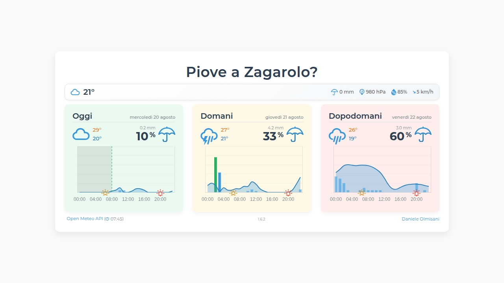

# 🤖 L'AI ha scritto tutto il codice, ma il vero controllo resta umano: lezioni da un progetto PWA

In un'era in cui l'intelligenza artificiale può generare intere applicazioni, ho voluto sperimentare fino a che punto si può spingere l'automazione nello svilupho software. Il risultato? **"Piove a Zagarolo?"**, una Progressive Web App per le previsioni meteo completamente sviluppata dall'AI.



## 🎯 Il Paradosso del Controllo: Più AI, Più Controllo Umano

Contrariamente a quello che si potrebbe pensare, delegare la programmazione all'AI **non riduce** la responsabilità dello sviluppatore - la amplifica. Ogni linea di codice generata automaticamente richiede una supervisione ancora più rigorosa.

### 📋 Requisiti Cristallini: La Base di Tutto

**L'AI non inventa requisiti - li esegue.** Nel mio progetto, ho dovuto essere estremamente preciso:

- ✅ "Mostra previsioni per 3 giorni con grafici orari"
- ✅ "Aggiorna dati ogni 15 minuti via GitHub Actions"
- ✅ "Funzionalità offline completa con Service Worker"
- ❌ ~~"Crea un'app meteo moderna"~~ (troppo vago)

**Lezione appresa**: Con l'AI, la chiarezza dei requisiti non è più un "nice to have" - è una necessità assoluta.

### 🏗️ Architettura Modulare: Il Framework del Successo

Ho definito una struttura rigida che l'AI doveva rispettare:

```
js/
├── main.js           # Entry point principale
├── modules/
│   ├── ui.js         # Logica interfaccia
│   ├── cache.js      # Gestione cache
│   ├── precipitation.js # Dati pioggia
│   └── constants.js  # Costanti condivise
```

**Risultato**: L'AI ha prodotto codice modulare, testabile e manutenibile perché gli ho dato un framework chiaro da seguire.

### 🧪 Test: La Rete di Sicurezza Essenziale

Anche se l'AI scrive il codice, sono io che devo definire **cosa testare**:

- Test di funzioni pure (`getRainIconClass`, gestione cache)
- Validazione dell'integrità PWA (manifest, service worker)
- Performance testing automatico via Lighthouse CI
- Controlli di regressione sui bundle size

**Insight importante**: L'AI è bravissima a scrivere test, ma tocca a noi umani decidere **quali** test scrivere.

## 🚀 Cosa Ha Gestito l'AI (Sorprendentemente Bene)

### 1. **Automazione CI/CD Complessa**
```yaml
# GitHub Actions per aggiornamenti automatici ogni 15 min
- cron: '*/15 * * * *'
```
L'AI ha creato workflow sofisticati che gestiscono:
- Fetch automatico dati meteo da Open-Meteo API
- Commit intelligenti con amend per evitare history bloat
- Generazione automatica di changelog da conventional commits

### 2. **Implementazione PWA Avanzata**
- Service Worker con cache-first strategy
- Gestione completa offline con fallback
- Manifest.json ottimizzato per installazione
- Badge di stato connessione dinamico

### 3. **UI/UX Responsive e Accessibile**
- Layout Bootstrap 5 completamente responsive
- Supporto screen reader con ARIA labels
- Dark mode con `prefers-color-scheme`
- Gestione touch-friendly per mobile

### 4. **Gestione Dati Sofisticata**
- Caching locale con TTL intelligente (3 ore)
- Blending di dati reali e previsionali
- Fallback graceful in caso di errori API
- Validazione JSON rigorosa

## 📊 I Numeri del Progetto

- **33KB** di JavaScript modulare (main.js)
- **85 linee** di Service Worker ottimizzato
- **Aggiornamenti automatici** ogni 15 minuti
- **3 giorni** di previsioni con grafici orari
- **Zero downtime** grazie alla gestione offline

## 🛠️ Stack Tecnologico (Tutto Gestito dall'AI)

**Frontend**: Vanilla JavaScript ES6+, Bootstrap 5, Chart.js
**PWA**: Service Worker, Web App Manifest
**Automazione**: GitHub Actions, Node.js scripts
**Dati**: Open-Meteo API, localStorage caching
**Deployment**: GitHub Pages con automazione completa

## 💡 Le Tre Regole d'Oro per Progetti AI-Driven

### 1. **Specificity is King**
Non dire "crea un sistema di cache" - specifica TTL, strategia di invalidazione, fallback behavior.

### 2. **Architecture First**
Prima di far scrivere una riga di codice all'AI, definisci moduli, dipendenze e interfacce.

### 3. **Test Everything**
L'AI può scrivere codice perfetto, ma solo se sa esattamente cosa deve fare e come verificarlo.

## 🔮 Il Futuro è Collaborativo

Questo progetto mi ha insegnato che **l'AI non sostituisce lo sviluppatore - lo potenzia**. Ma solo se manteniamo il controllo su:
- 🎯 **Vision** e requisiti
- 🏗️ **Architettura** e design patterns  
- 🧪 **Quality assurance** e testing strategy
- 📈 **Metriche** e criteri di successo

Il codice è solo l'esecuzione. La strategia, la visione e il controllo qualità rimangono saldamente umani.

---

**🔗 Prova l'app**: [pioveazagarolo.mad4j.dev](https://pioveazagarolo.mad4j.dev)  
**💾 Codice sorgente**: [GitHub - mad4j/pioveazagarolo](https://github.com/mad4j/pioveazagarolo)

**🛠️ Tecnologie utilizzate**: Open-Meteo API, GitHub Actions, Bootstrap 5, Chart.js, Service Workers, Progressive Web Apps

---

**#ArtificialIntelligence #SoftwareDevelopment #PWA #WebDevelopment #GitHub #JavaScript #WeatherApp #TechInnovation #SoftwareArchitecture #DevOps #OpenSource**

*Cosa ne pensate? Avete mai sperimentato lo sviluppo completamente guidato dall'AI? Condividete le vostre esperienze nei commenti! 👇*